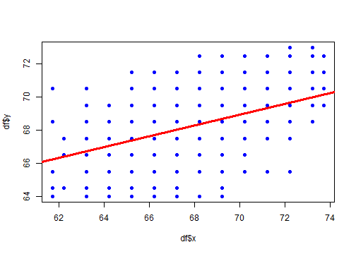
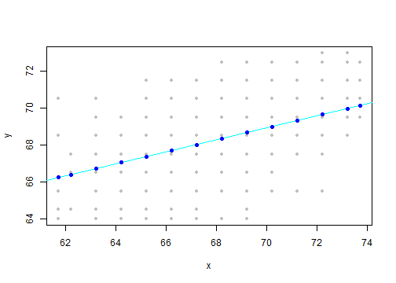
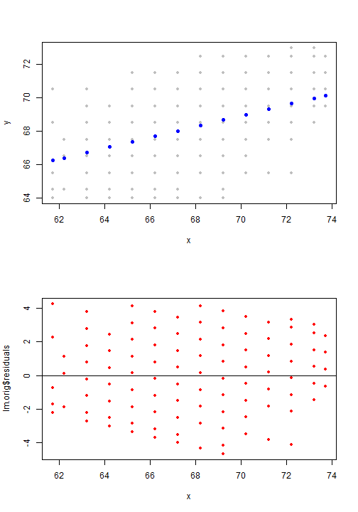
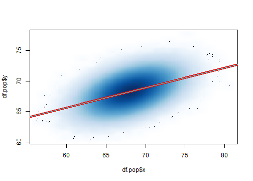
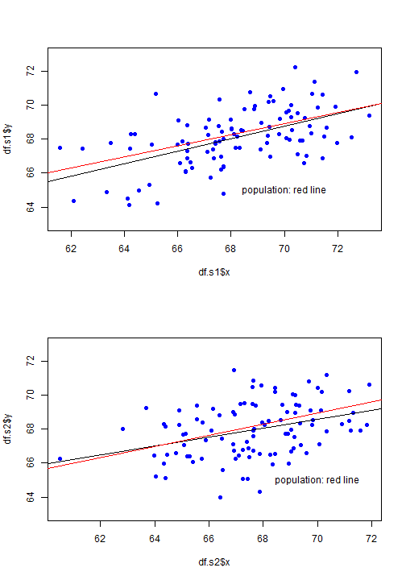
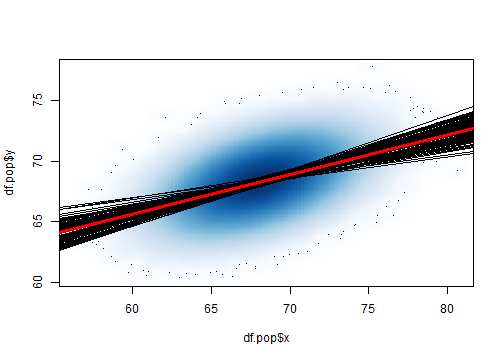
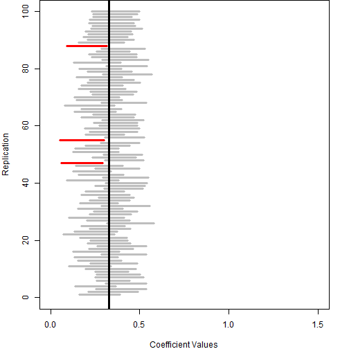

R Markdown, Population Sampling, & Confidence Intervals
========================================================
Topics:
* Introduce R Markdown

* **Gain an intuitive understanding of the errors we introduce when we look at subsets of an entire population through:**  
* population sampling  
  * linear models (coefficients, residuals, fitted.values)  
  * smoothScatter (example)
* confidence intervals
  * a brief intuition

One of the issues we'll be dealing with a lot is making inferences about a population, based on data from a subset of that population. My presentation tonight was inspired by and pulls heavily from one of the lectures in the Coursera Course, *Data Analysis*, by Professor Jeff Leek from John Hopkins. In it he demonstrated the effects of population sampling and confidence intervals in a way that I found very intuitive and accessible. In the process, he also demonstrated some very interesting techniques in R.

As a bonus, I think you will also see the usefulness of R markdown files.

see also:
* http://www.rstudio.com/ide/docs/authoring/using_markdown  
* http://jeromyanglim.blogspot.com/2012/05/example-reproducile-report-using-r.html  

R Markdown Quick Start
----------------------

I'm really a basic user, but I find it really useful for keeping track of what I'm doing in an analysis (and for generating homework).  
1. Install knitr: install.packages("knitr")  
2. The markdown Quick Reference is available by hitting the MD button above  
3. Use fig.width and fig.height to control plot outputs  
4. Get familiar with ctrl+alt+i, ctrl+alt+c, and ctrl+alt+r (see the chuncks button above)  
5. Use ctrl+Enter to run current line


That's really all there is to getting up and running ...

Population Sampling
-------------------

Start by loading in a data set


```r
list.of.packages <- c("UsingR", "knitr")
new.packages <- list.of.packages[!(list.of.packages %in% installed.packages()[, 
    "Package"])]
if (length(new.packages)) install.packages(new.packages)
rm(list.of.packages, new.packages)
library(UsingR)
```

```
## Loading required package: MASS
```

```r

data(galton)  # galton: Galton's height data for parents and children
df <- data.frame(x = galton$child, y = galton$parent)
```


Fit a linear model to the data and plot to see what we have:


```r
lm.orig <- lm(df$y ~ df$x)
plot(df$x, df$y, pch = 19, col = "blue")
abline(lm.orig, col = "red", lwd = 3)
```

 


Let's take a look at what we get with a linear model. Specifically, I want to  get a feel for what coefficients, fitted.values, and residuals are:


```r
names(lm.orig)
```

```
##  [1] "coefficients"  "residuals"     "effects"       "rank"         
##  [5] "fitted.values" "assign"        "qr"            "df.residual"  
##  [9] "xlevels"       "call"          "terms"         "model"
```

```r
lm.orig$coefficients
```

```
## (Intercept)        df$x 
##     46.1353      0.3256
```


```r
attach(df)
par(mfcol = c(1, 1))
# fitted.values
plot(y ~ x, pch = 20, col = "grey")
abline(lm.orig, col = 5)
points(x, lm.orig$fitted.values, pch = 19, col = "blue")
```

 

```r
par(mfcol = c(1, 1))
# calculate the predicted y values for each x. This is the same as
# fitted.values
y.pred <- lm.orig$coefficient[2] * x + lm.orig$coefficient[1]
sum(lm.orig$fitted.values - y.pred)
```

```
## [1] 7.811e-10
```


Now let's look at residuals


```r
par(mfcol = c(2, 1))
plot(y ~ x, pch = 20, col = "grey")
points(x, lm.orig$fitted.values, pch = 19, col = "blue")
plot(x, lm.orig$residuals, pch = 20, col = "red")
abline(h = 0, col = "black")
```

 

```r

# Calculate y(actual) - y(predicted)
res <- y - y.pred  # y(actual) - y(predicted)
round(sum(res - lm.orig$residuals), digits = 5)  # if this is zero, they are the same
```

```
## [1] 0
```

```r
detach(df)
```


How do we generate a large population with the same characteristics?:


```r
par(mfcol = c(1, 1))
set.seed(925)
n <- 1e+06  # size of population
df.pop <- data.frame(x = rep(NA, n), y = rep(NA, n))
df.pop$x <- rnorm(n, mean = mean(df$x), sd = sd(df$x))

# generate new y data of the form: lm1-intercept + lm1-slope*newX +
# noise(with same sd as lm.orig$residuals)
df.pop$y <- lm.orig$coefficients[1] + lm.orig$coefficients[2] * df.pop$x + rnorm(n, 
    mean = 0, sd = sd(lm.orig$residuals))

smoothScatter(df.pop$x, df.pop$y)
```

```
## KernSmooth 2.23 loaded Copyright M. P. Wand 1997-2009
```

```r

# just to make sure we did that right
abline(lm.orig, col = "red", lwd = 4)
lm.pop <- lm(df.pop$y ~ df.pop$x)
abline(lm.pop, col = 5)
```

 

```r

lm.orig$coeff
```

```
## (Intercept)        df$x 
##     46.1353      0.3256
```

```r
lm.pop$coeff
```

```
## (Intercept)    df.pop$x 
##     46.0864      0.3264
```


We now have a data set that represents an entire population and we can look at what happens when we only have access to a subset of that population. Our goal is to use that to gain an intuitive understanding of confidence interval as a measure of the accuracy of population characteristics based on our sample.

What happens when we take a sample of the population we have generated?


```r
par(mfcol = c(2, 1))
set.seed(123)
sample_size <- 100
df.s1 <- df.pop[sample(1:n, size = sample_size, replace = F), ]  # sample pulls from the supplied vector with equal probability
lm.s1 <- lm(df.s1$y ~ df.s1$x)
plot(df.s1$x, df.s1$y, pch = 19, col = "blue", ylim = c(63, 73))
abline(lm.s1, col = "black")
abline(lm.pop, col = "red")
text(x = 70, y = 65, "population: red line")

# Let's try another sample:

df.s2 <- df.pop[sample(1:n, size = sample_size, replace = F), ]
lm.s2 <- lm(df.s2$y ~ df.s2$x)
plot(df.s2$x, df.s2$y, pch = 19, col = "blue", ylim = c(63, 73))
abline(lm.s2, col = "black")
abline(lm.pop, col = "red")
text(x = 70, y = 65, "population: red line")
```

 


Now let's take a lot of samples ...


```r
par(mfcol = c(1, 1))
nSamples <- 100
lm.samples <- vector(nSamples, mode = "list")
for (i in 1:nSamples) {
    samp <- df.pop[sample(1:n, size = sample_size, replace = F), ]
    lm.samples[[i]] <- lm(samp$y ~ samp$x)  # we are creating a list of linear models
}
```


and make a plot.


```r
smoothScatter(df.pop$x, df.pop$y)
for (i in 1:nSamples) {
    abline(lm.samples[[i]], col = "black")
}
abline(lm.pop, col = "red", lwd = 3)
```

 


We are normally in a situation where we have access to just one of those black lines, so when that's all we have, what can we say about the population? The confidence interval gives us some insight.

Confidence Interval
-------------------

From Wikipedia, In statistics, a confidence interval (CI) is a type of interval estimate of a population parameter and is used to indicate the reliability of an estimate. (http://en.wikipedia.org/wiki/Confidence_interval).

Can we gain an intuitive understanding of that?

Let's go back to the last sample model we made, lm.s2. We can use confint as follows:


```r
ci.level <- 0.95
lm.s2$coeff
```

```
## (Intercept)     df.s2$x 
##     50.1087      0.2641
```

```r
confint(lm.s2, level = ci.level)
```

```
##               2.5 %  97.5 %
## (Intercept) 40.7878 59.4297
## df.s2$x      0.1264  0.4019
```


So we can say that our model predicts a slope of between .19 and .61 with a confidence of 95%.
But what does that really mean?

Next we will generate and plot that same confidence interval for the 100 different linear models we generated above (lm.samples). We will color the line grey if it contains the actual slope (lm.pop$coeff[2]) and red if it does not.


```r

par(mar=c(4,4,0,2))
plot(1:10, type="n", xlim=c(0,1.5), ylim=c(0,100), # 1:10 is arbitrary
     xlab="Coefficient Values", ylab="Replication")

for(i in 1:nSamples){
  ci <- confint(lm.samples[[i]], level=ci.level)
  color="red"
  # Does the ci contain the actual slope? If so color = grey
  if((ci[2,1] < lm.pop$coeff[2]) & (lm.pop$coeff[2] < ci[2,2])){color="grey"}
  segments(ci[2,1], i, ci[2,2], i, col=color, lwd=3)
}
abline(v=lm.pop$coeff[2], lwd=3)
```

 

We can see that we generated 3/100 cases that did not contain the actual slope. About 95% of the time the actual value was within the estimate.

What if we use a 90% confidence interval


```r
ci.level <- 0.90

par(mar=c(4,4,0,2))
plot(1:10, type="n", xlim=c(0,1.5), ylim=c(0,100), # 1:10 is arbitrary
     xlab="Coefficient Values", ylab="Replication")

for(i in 1:nSamples){
  ci <- confint(lm.samples[[i]], level=ci.level)
  color="red"
  # Does the ci contain the actual slope? If so color = grey
  if((ci[2,1] < lm.pop$coeff[2]) & (lm.pop$coeff[2] < ci[2,2])){color="grey"}
  segments(ci[2,1], i, ci[2,2], i, col=color, lwd=3)
}
abline(v=lm.pop$coeff[2], lwd=3)
```

 


How about 85%?


```r
ci.level <- 0.85

par(mar=c(4,4,0,2))
plot(1:10, type="n", xlim=c(0,1.5), ylim=c(0,100), # 1:10 is arbitrary
     xlab="Coefficient Values", ylab="Replication")

for(i in 1:nSamples){
  ci <- confint(lm.samples[[i]], level=ci.level)
  color="red"
  # Does the ci contain the actual slope? If so color = grey
  if((ci[2,1] < lm.pop$coeff[2]) & (lm.pop$coeff[2] < ci[2,2])){color="grey"}
  segments(ci[2,1], i, ci[2,2], i, col=color, lwd=3)
}
abline(v=lm.pop$coeff[2], lwd=3)
```

 


Misc:


```r
# difference between [] and [[]]
class(lm.samples[1])
```

```
## [1] "list"
```

```r
class(lm.samples[[1]])
```

```
## [1] "lm"
```


